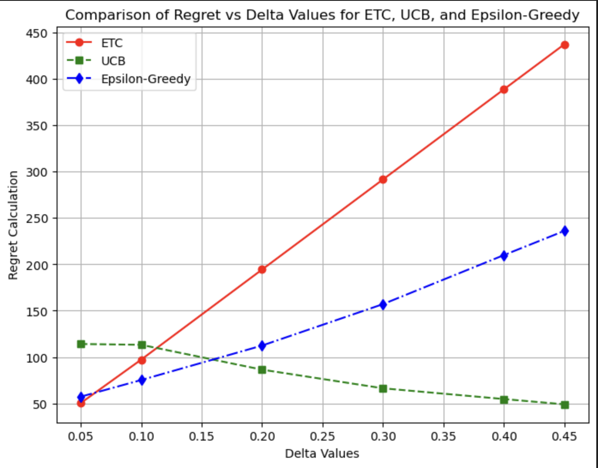

# Multi-Armed Bandits

This folder contains implementations and experiments with classic algorithms for the **K-armed bandit problem**.  
We compare three strategies on a 2-armed Bernoulli bandit with means (0.5, 0.5 + Δ):  

- **Explore-Then-Commit (ETC)**  
- **Upper Confidence Bound (UCB1)**  
- **ε-Greedy**  

---

## 📊 Experiments

### Experiment 1: ETC Demo Code
Initial demonstration of the ETC algorithm structure.

---

### Experiment 2: ETC Regret Plot for Different Δ
Regret grows approximately linearly with Δ.  
Because ETC explores for a fixed length `m`, it wastes pulls even when Δ is large.

---

### Experiment 3: UCB Regret Plot for Different Δ
Regret **decreases** as Δ increases.  
UCB balances exploration and exploitation adaptively, pulling the optimal arm more often when the reward gap widens.

---

### Experiment 4: ε-Greedy Algorithm
Regret **increases** with Δ, since random exploration (`ε`) continues throughout and mistakes become costlier when Δ is larger.

---

## 🔹 Final Comparison

- **UCB** achieves the lowest regret across Δ.  
- **ETC** performs reasonably but worse than UCB.  
- **ε-Greedy** suffers from constant exploration, leading to the highest regret.

---

## 📘 Conclusion

1. **Regret vs Δ:**  
   - UCB regret decreases with Δ (theoretically optimal trend).  
   - ETC regret increases with Δ due to fixed exploration length.  
   - ε-Greedy regret increases with Δ because constant exploration costs scale with Δ.

2. **Best Algorithm:**  
   - **UCB** consistently outperforms ETC and ε-Greedy.  
   - ETC is better than ε-Greedy but worse than UCB.  
   - ε-Greedy is simplest but least efficient.

3. **Takeaway:**  
   UCB1 is the most effective among the tested algorithms, demonstrating the benefit of adaptive exploration in bandit problems.
