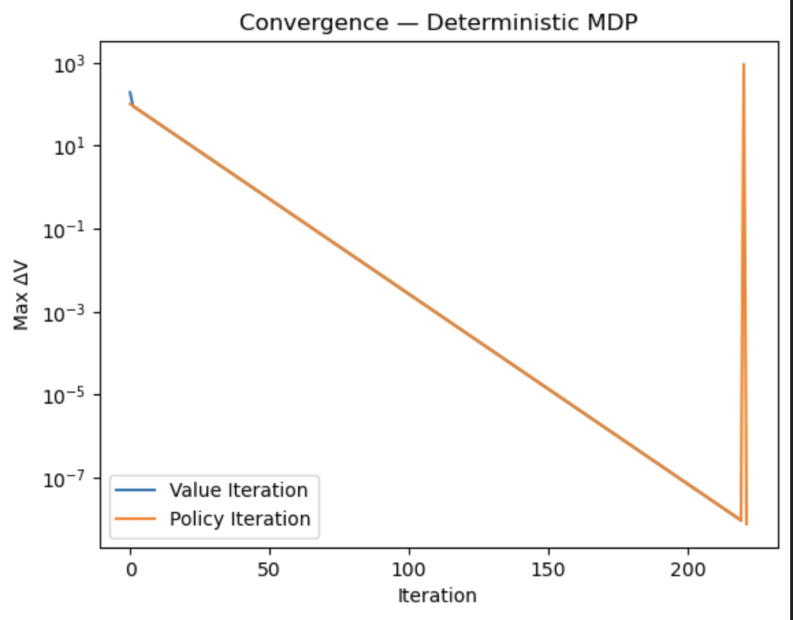

# Career Path MDP (Dynamic Programming)

This document describes a compact Markov Decision Process (MDP) that models simplified career choices and reports results from applying Dynamic Programming algorithms (Value Iteration and Policy Iteration).

## MDP specification

- States (index : description, immediate reward):
	- 0 : Unemployed (−10)
	- 1 : Industry (+100)
	- 2 : Grad School (0)
	- 3 : Academia (+10)
- Actions:
	- 0 : Research (R)
	- 1 : Development (D)
- Discount factor: $\gamma = 0.9$

- Deterministic transitions
- Stochastic transitions (small probability to remain in Academia when choosing Development)
The optimal policy is computed using both Value Iteration (VI) and Policy Iteration (PI). Results are presented for two environment variants:

- Deterministic transitions
- Stochastic transitions (small probability to remain in Academia when choosing Development)
- Deterministic transitions
- Stochastic transitions (small probability to remain in Academia when choosing Development)

### MDP diagrams

To visualise the MDPs used in these experiments, refer to the diagrams below:

Deterministic MDP

Stochastic MDP

## Policies evaluated

- Development (D): always choose Development (action 1) in every state
- Research (R): always choose Research (action 0) in every state
- Uncertain: choose each action with probability 0.5 in every state
- Random: one-hot random policy seeded for reproducibility (seed 42 used in the experiments)

## Experiment 1 — Deterministic transitions

Summary of results (representative runs):

| Start policy | 10-step rollout | PI sweeps (tol) | VI sweeps | Final policy (PI) |
|---:|---:|---:|---:|---|
| Development (D) | 1000.0 | 220 | 220 | [1 1 1 1] |
| Research (R) | 90.0 | 417 | 220 | [1 1 1 1] |
| Uncertain | 590.0 | 353 | 220 | [1 1 1 1] |
| Random (seed 42) | 90.0 | 222 | 220 | [1 1 1 1] |

Key observations:

- Both VI and PI identify Development (action 1) as the optimal action for all states in these experiments.
- Under deterministic dynamics the optimal state-values are approximately [1000, 1000, 1000, 1000]; the recurring +100 reward dominates long-term return.
- VI converges consistently in roughly 220 iterations. PI converges to the same policy but the required number of sweeps depends on the initial policy (fewer sweeps when starting near the optimum).

Convergence plots (deterministic):

Development | Research

<figure>
		
		
	<figcaption><strong>Left:</strong> Convergence plot when starting from Development. <strong>Right:</strong> Convergence plot when starting from Research.</figcaption>
</figure>

Uncertain | Random

<figure>
		
		
	<figcaption><strong>Left:</strong> Convergence plot when starting from an Uncertain policy. <strong>Right:</strong> Convergence plot for a Random seeded start (seed 42).</figcaption>
</figure>

## Experiment 2 — Stochastic transitions

Small stochasticity is added to transitions (example: from Academia with Development, 0.9 → Industry, 0.1 → stay in Academia). Results (my runs):

| Start policy | 10-step rollout | V(policy) on stochastic env | PI sweeps (tol) | VI sweeps | Final policy |
|---:|---:|---|---:|---:|---|
| Development (D) | 1000.0 | [1000., 1000., 1000., 990.11] | 220 | 220 | [1 1 1 1] |
| Research (R) | 100.0 | [ 89.01, 80.33, 98.90, 100.00 ] | 417 | 220 | [1 1 1 1] |
| Uncertain | ~400.0 | [509.00, 508.21, 511.79, 507.57] | 357 | 220 | [1 1 1 1] |
| Random (seed 42) | 100.0 | [1000., 1000., 1000., 100.] | 232 | 220 | [1 1 1 1] |

Differences compared to deterministic dynamics:

- The optimal policy remains Development in all states.
- Only Academia (state 3) loses value under the stochastic transition model. Intuition and exact equation:

Let $V_1 \approx 1000$ be value of Industry and $\gamma=0.9$. If in state 3 (Academia) you choose Development and with probability 0.9 you go to Industry and with probability 0.1 remain in Academia, then
$$
V_3 = 0.9\left(100 + \gamma V_1\right) + 0.1\left(10 + \gamma V_3\right).
$$
Solving with $V_1\approx 1000$ and $\gamma=0.9$ gives $V_3 \approx 990.11$.

- Episode returns differ only at the start (you may collect a +10 once); once the process reaches Industry the +100/step loop dominates.

Convergence notes:

- VI requires ~220 iterations across different starting policies in these runs.
- PI sweep counts vary with the initial policy (examples from runs: 220 from D, 232 from Random, 357 from Uncertain, 417 from R).

Convergence plots (stochastic):

Development | Research

<figure>
		
		
	<figcaption><strong>Left:</strong> Deterministic -> Stochastic convergence from Development start. <strong>Right:</strong> Stochastic start from Research policy.</figcaption>
</figure>

Uncertain | Random

<figure>
		
		
	<figcaption><strong>Left:</strong> Stochastic convergence from an Uncertain start. <strong>Right:</strong> Stochastic convergence from a Random start (seed 42).</figcaption>
</figure>

## Sanity checks

- Evaluating the VI policy with the deterministic `EvaluatePolicy` and the stochastic `EvaluatePolicy_stochastic` reproduces the values learned by VI.
- The configured start policy drives the demo rollout and the initial policy for PI. Randomized trials are used only to report min/max/avg sweep counts.

## Summary

- Optimal behaviour: choose Development in all states.
- Representative values: under deterministic dynamics state-values ≈ [1000, 1000, 1000, 1000]; under stochastic transitions Academia ≈ 990.
- Convergence: VI is stable (≈220 iterations). PI finds the same optimal policy but sweep count depends on the starting policy.
- Policies: Development is optimal; Research and Uncertain policies are suboptimal; Random policy performance varies with the random seed.